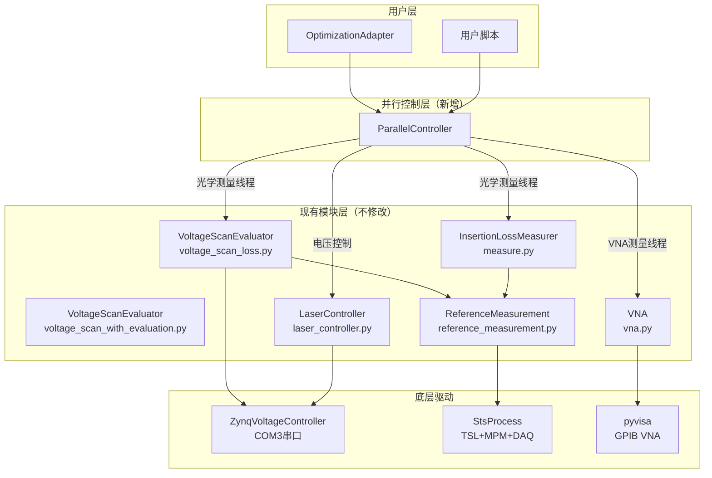

# 设计文档：并行仪器控制系统

## 概述

本设计基于现有代码库中的6个核心文件，引入一个轻量级的 `ParallelController` 协调层，实现VNA矢网仪测量与光学插损测量（电压扫描+STS扫描）的并行执行。

核心设计原则：
- 直接复用现有的6个类（`LaserController`、`InsertionLossMeasurer`、`ReferenceMeasurement`、`VNA`、`VoltageScanEvaluator`（自动版/交互版）），不修改其内部实现
- 新增一个 `ParallelController` 类作为唯一的新组件
- 使用 `concurrent.futures.ThreadPoolExecutor` 实现并行，因为仪器操作是I/O密集型（GPIB/VISA通信、串口通信）
- 保持与现有 `OptimizationAdapter` 的兼容性

### 关键发现

通过分析现有代码，确认以下并行可行性：

| 仪器 | 通信方式 | 物理独立性 |
|------|---------|-----------|
| TSL+MPM+DAQ（光学系统） | GPIB + SPU | 共享StsProcess实例 |
| ZynqVoltageController | COM3串口 | 独立，但与光学测量有时序依赖 |
| VNA（思仪3671G） | GPIB（独立地址） | 完全独立，可并行 |

VNA使用独立的GPIB地址和pyvisa资源管理器，与光学系统（TSL/MPM/DAQ）完全独立，因此VNA测量可以与光学测量完全并行执行。

## 架构

### 系统分层架构



### 并行执行流程

```mermaid
sequenceDiagram
    participant User as 用户/优化器
    participant PC as ParallelController
    participant TPE as ThreadPoolExecutor
    participant OPT as 光学测量线程
    participant VNA as VNA测量线程

    User->>PC: run_parallel_measurement(voltages)
    PC->>TPE: submit(optical_task)
    PC->>TPE: submit(vna_task)

    par 并行执行
        OPT->>OPT: ZynqVoltageController.set_voltages()
        OPT->>OPT: time.sleep(settle_time)
        OPT->>OPT: ReferenceMeasurement.measure_insertion_loss()
    and
        VNA->>VNA: VNA.measure()
    end

    OPT-->>TPE: optical_result
    VNA-->>TPE: vna_result
    TPE-->>PC: 合并结果
    PC-->>User: ParallelResult
```

## 组件与接口

### ParallelController（唯一新增类）

```python
import logging
import time
import threading
from concurrent.futures import ThreadPoolExecutor, Future, as_completed
from dataclasses import dataclass, field
from typing import Optional, Dict, Any, List, Callable
from enum import Enum

class TaskStatus(Enum):
    PENDING = "pending"
    RUNNING = "running"
    COMPLETED = "completed"
    FAILED = "failed"

@dataclass
class ParallelResult:
    """并行测量结果"""
    session_id: str                          # 时间戳会话标识
    optical_data: Optional[Dict[str, Any]]   # 光学测量数据（波长、插损等）
    vna_data: Optional[Dict[str, Any]]       # VNA测量数据（频率、S参数等）
    voltages_applied: Optional[List[float]]  # 施加的电压
    optical_status: TaskStatus               # 光学测量状态
    vna_status: TaskStatus                   # VNA测量状态
    optical_error: Optional[str] = None      # 光学测量错误信息
    vna_error: Optional[str] = None          # VNA测量错误信息
    start_time: float = 0.0
    end_time: float = 0.0

class ParallelController:
    """
    并行仪器控制器 - 协调VNA与光学测量的并行执行
    
    直接复用现有类：
    - VoltageScanEvaluator (voltage_scan_loss.py) 用于电压扫描+光学测量
    - VNA (vna.py) 用于矢网仪S参数测量
    - ReferenceMeasurement (reference_measurement.py) 用于光学参考测量
    - ZynqVoltageController (zynq_voltage_controller.py) 用于电压控制
    """
    
    def __init__(self, config: Optional[Dict] = None):
        """
        初始化并行控制器
        
        参数:
            config: 配置字典，可选。包含：
                - voltage_settle_time: 电压稳定等待时间（秒），默认0.5
                - max_workers: 最大并行线程数，默认2
                - vna_gpib_address: VNA GPIB地址，默认16
                - vna_start_freq: VNA起始频率，默认10e6
                - vna_stop_freq: VNA终止频率，默认30e9
                - vna_points: VNA扫描点数，默认6001
                - vna_param: VNA测量参数，默认'S21'
                - output_dir: 输出目录，默认'./parallel_results'
        """
        self._config = config or {}
        self._voltage_settle_time: float
        self._max_workers: int
        self._output_dir: str
        
        # 仪器实例（延迟初始化）
        self._voltage_controller: Optional[ZynqVoltageController] = None
        self._reference_measurement: Optional[ReferenceMeasurement] = None
        self._vna: Optional[VNA] = None
        
        # 线程池
        self._executor: Optional[ThreadPoolExecutor] = None
        
        # 线程安全锁
        self._optical_lock: threading.Lock   # 保护光学系统（TSL+MPM+DAQ+电压控制器）
        self._vna_lock: threading.Lock       # 保护VNA
        self._result_lock: threading.Lock    # 保护结果收集
        
        # 状态
        self._initialized: bool = False
        self._results: List[ParallelResult] = []
        self._logger: logging.Logger
    
    def initialize(self) -> bool:
        """
        初始化所有仪器
        
        流程：
        1. 初始化ZynqVoltageController（COM3, 4通道）
        2. 初始化ReferenceMeasurement（连接TSL+MPM+DAQ，配置参数，执行/加载参考测量）
        3. 初始化VNA（连接GPIB，设置参数）
        4. 创建ThreadPoolExecutor
        
        返回:
            bool: 所有仪器初始化是否成功
        """
    
    def run_parallel_measurement(
        self,
        voltages: List[float],
        include_vna: bool = True
    ) -> ParallelResult:
        """
        执行一次并行测量：设置电压 → 并行执行光学测量和VNA测量
        
        参数:
            voltages: 电压列表（4通道）
            include_vna: 是否同时执行VNA测量
            
        返回:
            ParallelResult: 合并后的测量结果
        """
    
    def run_voltage_sweep_parallel(
        self,
        channel: int,
        start_voltage: float,
        end_voltage: float,
        step_voltage: float,
        include_vna: bool = True
    ) -> List[ParallelResult]:
        """
        并行电压扫描：对每个电压点，并行执行光学测量和VNA测量
        
        参数:
            channel: 控制通道（1-4）
            start_voltage: 起始电压
            end_voltage: 终止电压
            step_voltage: 步进电压
            include_vna: 是否同时执行VNA测量
            
        返回:
            List[ParallelResult]: 每个电压点的并行测量结果
        """
    
    def create_optimization_objective(
        self,
        optical_objective_func: Callable,
        include_vna: bool = False
    ) -> Callable:
        """
        创建与OptimizationAdapter兼容的目标函数
        
        参数:
            optical_objective_func: 现有的光学目标函数（如SpectralFunctions中的方法）
            include_vna: 是否在优化过程中同时执行VNA测量
            
        返回:
            Callable: 签名为 (voltages) -> dict 的目标函数
                     返回值包含 'fom', 'voltages' 键，与BaseFunctionManager兼容
                     如果include_vna=True，还包含 'vna_data' 键
        """
    
    def _run_optical_measurement(self, voltages: List[float]) -> Dict[str, Any]:
        """
        执行光学测量（在光学线程中运行）
        
        流程：
        1. 获取optical_lock
        2. ZynqVoltageController.set_voltages(voltages)
        3. time.sleep(voltage_settle_time)
        4. ReferenceMeasurement.measure_insertion_loss()
        5. 提取wavelength_table和il_data_array
        6. 释放optical_lock
        
        返回:
            dict: 包含wavelengths, il_data等光学测量数据
        """
    
    def _run_vna_measurement(self) -> Dict[str, Any]:
        """
        执行VNA测量（在VNA线程中运行）
        
        流程：
        1. 获取vna_lock
        2. VNA.measure()
        3. 释放vna_lock
        
        返回:
            dict: 包含frequency, s_param, magnitude_dB, phase_deg
        """
    
    def emergency_stop(self) -> None:
        """
        紧急停止：停止所有任务，电压置零
        
        流程：
        1. executor.shutdown(wait=False, cancel_futures=True)
        2. ZynqVoltageController.set_voltages([0,0,0,0])
        """
    
    def get_results(self) -> List[ParallelResult]:
        """获取所有测量结果"""
    
    def export_results_csv(self, filepath: str) -> None:
        """导出结果到CSV文件"""
    
    def get_status(self) -> Dict[str, Any]:
        """
        获取系统状态
        
        返回:
            dict: 包含各仪器连接状态、当前电压、测量计数等
        """
    
    def shutdown(self) -> None:
        """
        关闭系统
        
        流程：
        1. 电压置零
        2. 关闭VNA连接
        3. 关闭ZynqVoltageController串口
        4. 关闭ThreadPoolExecutor
        5. 重置TSL/MPM
        """
```

### 与现有类的交互方式

ParallelController 通过组合方式持有现有类的实例，不继承也不修改它们：

```python
# 初始化示例
def initialize(self):
    # 1. 电压控制器 - 复用 ZynqVoltageController
    from zynq_voltage_controller import ZynqVoltageController
    self._voltage_controller = ZynqVoltageController(port='COM3', num_channels=4)
    self._voltage_controller.initialize()
    
    # 2. 光学测量系统 - 复用 ReferenceMeasurement
    from reference_measurement import ReferenceMeasurement
    self._reference_measurement = ReferenceMeasurement()
    self._reference_measurement.initialize_optical_devices()
    self._reference_measurement.configure_reference_parameters()
    # 执行或加载参考测量...
    
    # 3. VNA - 复用 VNA 类
    from vna import VNA
    self._vna = VNA(
        gpib_address=self._config.get('vna_gpib_address', 16),
        start_freq=self._config.get('vna_start_freq', 10e6),
        stop_freq=self._config.get('vna_stop_freq', 30e9),
        points=self._config.get('vna_points', 6001),
        param=self._config.get('vna_param', 'S21')
    )
    self._vna.connect()
    self._vna.setup_parameters()
    
    # 4. 线程池
    self._executor = ThreadPoolExecutor(max_workers=self._max_workers)
```

### 与OptimizationAdapter的兼容

```python
# 使用示例：在优化过程中并行执行VNA测量
from parallel_controller import ParallelController
from spectral_functions import SpectralFunctions
from optimization_adapter import OptimizationAdapter

# 初始化并行控制器
pc = ParallelController(config={
    'vna_gpib_address': 16,
    'voltage_settle_time': 0.5
})
pc.initialize()

# 创建兼容的目标函数（内部会并行执行VNA测量）
# optical_func 是 SpectralFunctions 中的某个方法
objective = pc.create_optimization_objective(
    optical_objective_func=spectral_funcs.spectral_smoothness,
    include_vna=True
)

# 直接传给 OptimizationAdapter
adapter = OptimizationAdapter(optimizer, objective, optimizer_type="PSO")
best_voltages, best_fom, result = adapter.optimize()
```

`create_optimization_objective` 返回的闭包函数：
- 接受 `voltages` 参数（与 `BaseFunctionManager` 中的目标函数签名一致）
- 返回包含 `'fom'` 和 `'voltages'` 键的字典（与 `BaseFunctionManager._format_result_output()` 一致）
- 测量失败时返回 `{'voltages': -1, 'fom': 1000.0}`（与 `BaseFunctionManager.get_error_output()` 一致）
- 如果 `include_vna=True`，额外在后台线程执行VNA测量并将结果附加到返回字典

## 数据模型

### ParallelResult 数据结构

```python
@dataclass
class ParallelResult:
    session_id: str                          # 格式: "YYYYMMDD_HHMMSS_xxx"
    
    # 光学测量数据（来自 ReferenceMeasurement / StsProcess）
    optical_data: Optional[Dict[str, Any]]
    # optical_data 结构:
    # {
    #     "wavelengths": List[float],           # 波长数组 (nm)
    #     "il_data": List[List[float]],         # 各通道插损数据 (dB)
    #     "reference_data_array": List[dict],   # StsProcess原始数据
    # }
    
    # VNA测量数据（来自 VNA.measure()）
    vna_data: Optional[Dict[str, Any]]
    # vna_data 结构:
    # {
    #     "frequency": np.ndarray,      # 频率数组 (Hz)
    #     "s_param": np.ndarray,        # 复数S参数
    #     "magnitude_dB": np.ndarray,   # 幅度 (dB)
    #     "phase_deg": np.ndarray,      # 相位 (度)
    # }
    
    voltages_applied: Optional[List[float]]  # 4通道电压值
    optical_status: TaskStatus
    vna_status: TaskStatus
    optical_error: Optional[str] = None
    vna_error: Optional[str] = None
    start_time: float = 0.0
    end_time: float = 0.0
```

### 配置字典结构

```python
default_config = {
    "voltage_settle_time": 0.5,       # 电压稳定等待时间（秒）
    "max_workers": 2,                  # 最大并行线程数（光学+VNA）
    "output_dir": "./parallel_results",
    
    # VNA配置
    "vna_gpib_address": 16,
    "vna_start_freq": 10e6,            # 10 MHz
    "vna_stop_freq": 30e9,             # 30 GHz
    "vna_points": 6001,
    "vna_power": -10,                  # dBm
    "vna_if_bw": 1000,                # Hz
    "vna_param": "S21",
    
    # 电压控制器配置
    "voltage_port": "COM3",
    "voltage_num_channels": 4,
    "voltage_baudrate": 115200,
}
```


## 正确性属性

*正确性属性是在系统所有有效执行中都应成立的特征或行为——本质上是关于系统应该做什么的形式化陈述。属性是人类可读规范与机器可验证正确性保证之间的桥梁。*

### 属性 1：仪器初始化完整性

*对于任意*有效的配置字典，调用 `initialize()` 成功后，ParallelController 内部的 `_voltage_controller`、`_reference_measurement` 和 `_vna` 三个实例引用均应为非 None，且 `_initialized` 为 True。

**验证需求: 1.1**

### 属性 2：仪器互斥访问

*对于任意*数量的并发线程同时请求同一仪器锁（`_optical_lock` 或 `_vna_lock`），在任意时刻最多只有一个线程持有该锁。即：两个使用同一仪器的测量任务的执行时间区间不应重叠。

**验证需求: 1.2, 1.3, 2.3**

### 属性 3：状态查询一致性

*对于任意*仪器状态变化序列（初始化、测量中、测量完成、故障），`get_status()` 返回的字典应包含所有已注册仪器的状态信息，且每个状态值应与最近一次状态变更操作一致。

**验证需求: 1.6, 2.6**

### 属性 4：电压先于扫描执行

*对于任意*包含电压设置和光学扫描的测量任务，`_run_optical_measurement` 中 `set_voltages()` 的调用时间戳应严格早于 `measure_insertion_loss()` 的调用时间戳，且两者之间的间隔不小于配置的 `voltage_settle_time`。

**验证需求: 3.2, 3.3**

### 属性 5：电压失败级联跳过

*对于任意*电压设置失败的场景（`set_voltages()` 返回 False 或抛出异常），对应的 ParallelResult 中 `optical_status` 应为 `FAILED`，`optical_error` 应为非空字符串，且不应执行后续的光学扫描操作。

**验证需求: 3.4, 1.4**

### 属性 6：批量扫描结果数量一致

*对于任意*长度为 N 的电压扫描序列（由 start_voltage、end_voltage、step_voltage 确定），`run_voltage_sweep_parallel()` 应返回恰好 N 个 ParallelResult，且每个结果的 `voltages_applied` 对应电压序列中的一个值。

**验证需求: 3.5**

### 属性 7：VNA 与光学测量并行执行

*对于任意*设置了 `include_vna=True` 的并行测量，VNA 测量任务的开始时间应早于光学测量任务的结束时间（即两者的执行时间区间存在重叠），证明它们确实在并行执行。

**验证需求: 4.1**

### 属性 8：成功任务的结果完整性

*对于任意*两项测量（光学和VNA）均成功完成的并行测量，返回的 ParallelResult 中 `optical_data` 和 `vna_data` 均应为非 None，且 `optical_status` 和 `vna_status` 均为 `COMPLETED`。

**验证需求: 2.5, 4.3**

### 属性 9：独立仪器故障隔离

*对于任意*并行测量中的单个仪器故障（VNA 或光学系统），使用另一台独立仪器的测量任务应不受影响地正常完成。即：如果 VNA 测量抛出异常，光学测量的 `optical_status` 仍应为 `COMPLETED`（反之亦然）。

**验证需求: 4.4, 7.1**

### 属性 10：优化接口兼容性

*对于任意*有效的电压数组，`create_optimization_objective()` 返回的函数应返回一个包含 `'fom'` 和 `'voltages'` 键的字典，其格式与 `BaseFunctionManager._format_result_output()` 的输出一致。

**验证需求: 5.1**

### 属性 11：错误输出一致性

*对于任意*导致测量失败的输入，优化目标函数应返回 `{'voltages': -1, 'fom': 1000.0}`，与现有 `BaseFunctionManager.get_error_output()` 的行为完全一致。

**验证需求: 5.4**

### 属性 12：会话标识唯一性

*对于任意*两次不同的并行测量调用，生成的 ParallelResult 的 `session_id` 应互不相同。

**验证需求: 6.1, 6.2**

### 属性 13：CSV 导出往返一致性

*对于任意*一组 ParallelResult，调用 `export_results_csv()` 导出后重新读取 CSV 文件，应能恢复每个结果的 `session_id`、`optical_status`、`vna_status` 和 `voltages_applied`。

**验证需求: 6.3**

### 属性 14：测量数据自动持久化

*对于任意*已完成的并行测量（无论成功或失败），`output_dir` 中应存在对应的数据文件，且 `get_results()` 返回的结果数量应等于已执行的测量次数。

**验证需求: 5.5, 6.5**

### 属性 15：配置加载正确性

*对于任意*有效的配置字典，ParallelController 初始化后的 `_voltage_settle_time`、`_max_workers` 和 VNA 参数应与配置字典中的对应值一致。未指定的参数应使用默认值。

**验证需求: 8.1, 3.3**

### 属性 16：扫描中仪器故障级联

*对于任意*电压扫描序列，如果 VNA 在第 K 个电压点变为不可用，则第 K+1 到第 N 个电压点的 ParallelResult 中 `vna_status` 应为 `FAILED`，`vna_error` 应包含故障原因，但 `optical_status` 应不受影响。

**验证需求: 7.5**

## 错误处理

### 错误分级

| 级别 | 场景 | 处理策略 |
|------|------|---------|
| WARNING | 单个VNA或光学测量失败 | 记录错误到ParallelResult，继续其他任务 |
| ERROR | 仪器通信断开（串口/GPIB） | 标记对应仪器不可用，后续任务跳过该仪器 |
| CRITICAL | 多仪器同时故障 | 触发emergency_stop，电压置零，保存已有数据 |

### 关键错误场景与处理

1. **电压设置失败**（`ZynqVoltageController.set_voltages()` 返回 False）
   - 跳过光学扫描
   - ParallelResult.optical_status = FAILED
   - 如果include_vna=True，VNA测量仍然执行

2. **STS扫描异常**（`ReferenceMeasurement.measure_insertion_loss()` 抛出异常）
   - 捕获异常，记录到optical_error
   - VNA测量不受影响

3. **VNA通信超时**（`pyvisa.VisaIOError`）
   - 捕获异常，记录到vna_error
   - 光学测量不受影响
   - 后续扫描点标记VNA为不可用

4. **串口断开**（`serial.SerialException`）
   - 捕获异常，触发emergency_stop
   - 所有电压置零

5. **紧急停止**
   ```python
   def emergency_stop(self):
       # 1. 停止线程池
       if self._executor:
           self._executor.shutdown(wait=False, cancel_futures=True)
       # 2. 电压置零（直接调用，不经过线程池）
       if self._voltage_controller:
           try:
               self._voltage_controller.set_voltages([0.0] * 4)
           except Exception:
               pass  # 尽力而为
   ```

### 与现有错误处理的兼容

优化目标函数的错误输出与 `BaseFunctionManager.get_error_output()` 保持一致：
```python
error_output = {'voltages': -1, 'fom': 1000.0}
```

## 测试策略

### 测试框架

- **单元测试**: `pytest`
- **属性测试**: `hypothesis`（Python属性测试库）
- **并发测试**: `threading` + `hypothesis`

### 属性测试配置

- 每个属性测试最少运行 100 次迭代
- 使用 `@settings(max_examples=100)` 配置 hypothesis
- 每个测试用 `@given` 装饰器生成随机输入
- 每个属性测试必须用注释标注对应的设计属性

标注格式：
```python
# Feature: parallel-instrument-control, Property 2: 仪器互斥访问
```

### Mock 策略

由于实际仪器不可用于自动化测试，需要Mock以下现有类：

| Mock 类 | 模拟对象 | 关键行为 |
|---------|---------|---------|
| `MockZynqVoltageController` | `ZynqVoltageController` | `set_voltages()` 记录调用参数，返回True/False |
| `MockReferenceMeasurement` | `ReferenceMeasurement` | `measure_insertion_loss()` 生成随机波长/插损数据 |
| `MockVNA` | `VNA` | `measure()` 生成随机频率/S参数数据 |
| `MockStsProcess` | `StsProcess` | 提供 `wavelength_table` 和 `il_data_array` |

Mock对象必须保持与真实类一致的方法签名和返回类型。

### 单元测试覆盖

单元测试聚焦于具体场景和边界条件：

- 初始化流程：各仪器连接成功/失败的组合（需求 1.5）
- VNA与光学并行启动的集成验证（需求 4.2）
- 紧急停止的时序验证（需求 7.2, 7.3）
- 优化目标函数的端到端流程（需求 5.2, 5.3）
- 默认配置值验证（需求 8.2）

### 属性测试覆盖

属性测试覆盖设计文档中的16个正确性属性。关键生成器策略：

- **电压列表生成器**：生成4元素列表，每个值在0.0-10.0范围内
- **配置字典生成器**：生成包含有效参数范围的配置字典
- **ParallelResult生成器**：生成包含各种状态组合的结果对象
- **故障注入生成器**：随机选择VNA或光学系统注入异常

### 测试目录结构

```
tests/
├── test_parallel_controller.py   # ParallelController 单元测试 + 属性测试
├── conftest.py                   # 共享 fixtures 和 Mock 定义
└── generators.py                 # hypothesis 自定义生成器
```
