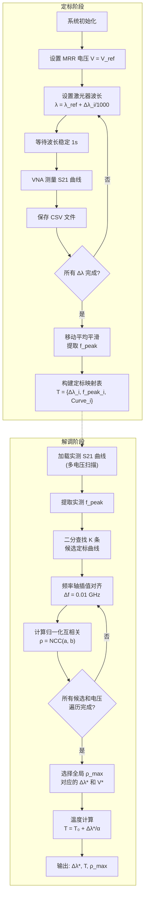

# 定标流程与解调算法设计

## 一、系统工作原理

本系统采用光纤布拉格光栅（FBG）与微环谐振器（MRR）级联的传感架构，通过矢量网络分析仪（VNA）测量 S21 传输谱实现温度解调。其核心原理为：

- **FBG 温度响应**：FBG 中心波长 λ_FBG 随温度变化发生偏移，灵敏度系数 α ≈ 9.08 pm/°C，即 Δλ = α·ΔT；
- **MRR 频率响应**：MRR 的谐振峰频率 f_peak 与输入光波长密切相关，当 FBG 波长偏移 Δλ 时，MRR 的 S21 传输谱谐振峰位置随之移动；
- **电压调谐**：通过 Zynq FPGA 控制 MRR 上的热光调谐电压 V，可改变 MRR 有效折射率，从而调节谐振峰位置。

系统通过建立"波长偏移 Δλ ↔ S21 曲线形状"的定标映射关系，将实时测量的 S21 曲线与定标库进行匹配，反推出 FBG 波长偏移量，进而计算温度。

## 二、定标流程

### 2.1 定标原理

定标阶段的目标是建立 Δλ → S21 曲线的完整映射表。具体方法为：固定 MRR 调谐电压为参考值 V_ref（本系统取 1.25V），通过可调谐激光器逐步改变输入光波长来模拟 FBG 的波长偏移效果。

### 2.2 定标参数

| 参数 | 值 | 说明 |
|------|------|------|
| 参考波长 λ_ref | 1551.85 nm | FBG 设计中心波长 |
| 参考电压 V_ref | 1.25 V | MRR 固定调谐电压 |
| 波长偏移范围 | -160 ~ +160 pm | 覆盖 ±17.6°C 温度变化 |
| 波长偏移步长 | 2 pm | 对应 ~0.22°C 分辨率 |
| VNA 频率范围 | 10 MHz ~ 30 GHz | S21 测量频段 |
| VNA 扫描点数 | 6001 | 频率分辨率 ~5 MHz |
| VNA 功率 | -10 dBm | 测量激励功率 |
| IF 带宽 | 1000 Hz | 中频滤波带宽 |

### 2.3 定标步骤

1. **系统初始化**：连接激光器、VNA、Zynq 控制器；设置 MRR 电压为 V_ref = 1.25V；
2. **波长扫描**：对每个波长偏移值 Δλ_i（i = 1, 2, ..., 161）：
   - 设置激光器波长为 λ = λ_ref + Δλ_i / 1000（pm 转 nm）；
   - 等待波长稳定（1 秒）；
   - VNA 执行 S21 测量，获取频率-幅度数据对 {f_k, |S21|_k}；
   - 保存为 CSV 文件；
3. **定标表构建**：对每条定标曲线执行移动平均平滑（窗口 N=5），提取谐振峰频率 f_peak_i；构建定标映射表 T = {(Δλ_i, f_peak_i, Curve_i)}，按 f_peak 升序排列。

### 2.4 峰值频率提取算法

对 S21 曲线 M(f) 执行均匀移动平均平滑：

    M̃(f_k) = (1/N) · Σ_{j=0}^{N-1} M(f_{k+j})

取平滑后幅度最大值对应的频率作为谐振峰频率：

    f_peak = argmax_f M̃(f)

## 三、解调算法设计（归一化互相关匹配法）

### 3.1 算法概述

解调阶段的输入为实时测量的 S21 曲线（在不同 MRR 电压下采集），输出为 FBG 波长偏移量 Δλ 及对应温度 T。核心思想是：将实测曲线与定标库中的曲线进行归一化互相关比较，选择相关系数最大的定标曲线对应的 Δλ 作为解调结果。

### 3.2 算法步骤

#### 步骤 1：加载测量数据

对每个调谐电压 V_j（j = 1, 2, ..., M），VNA 测量得到一条 S21 曲线 C_meas_j(f)。

#### 步骤 2：候选曲线筛选

对实测曲线提取峰值频率 f_meas，在定标表中通过二分查找（bisect）找到 f_peak 最接近的 K 条候选定标曲线（默认 K=3），减少后续计算量。

#### 步骤 3：频率轴对齐

将实测曲线与候选定标曲线插值到公共频率网格。取两条曲线频率范围的交集 [f_min, f_max]，以步长 Δf = 0.01 GHz 生成公共频率轴，对两条曲线分别进行线性插值对齐。

#### 步骤 4：归一化互相关计算

对对齐后的实测幅度序列 a = {a_1, ..., a_n} 和定标幅度序列 b = {b_1, ..., b_n}，计算归一化互相关系数：

    ρ = Σ_{i=1}^{n} (a_i - ā)(b_i - b̄) / (n · σ_a · σ_b)

其中 ā、b̄ 为均值，σ_a、σ_b 为标准差。ρ ∈ [-1, 1]，值越接近 1 表示两条曲线形状越相似。

#### 步骤 5：最佳匹配选择

对所有候选曲线计算 ρ，选择 ρ 最大的候选曲线作为最佳匹配。遍历所有电压下的测量曲线，选择全局 ρ 最大的电压-定标对作为最终结果：

    (V*, Δλ*) = argmax_{j,i} ρ(C_meas_j, C_cal_i)

#### 步骤 6：温度计算

由最佳匹配的波长偏移 Δλ* 计算温度：

    T = T₀ + Δλ* / α

其中 T₀ = 20°C 为基准温度，α = 9.08 pm/°C 为 FBG 温度灵敏度系数。

### 3.3 算法特点

1. **全频段形状匹配**：不仅依赖峰值频率位置，还利用整条 S21 曲线的形状信息，提高匹配鲁棒性；
2. **归一化处理**：互相关系数对幅度偏移和缩放不敏感，适应不同测量条件下的幅度变化；
3. **候选预筛选**：通过峰值频率二分查找快速缩小搜索范围，将 O(N) 的全表遍历降为 O(K) 的局部比较，显著提升计算效率；
4. **多电压扫描**：通过扫描多个 MRR 调谐电压，增加匹配维度，提高解调可靠性和抗噪声能力。

## 四、算法流程图

## 五、关键公式汇总

| 序号 | 公式 | 物理含义 |
|------|------|----------|
| 1 | Δλ = α · ΔT | FBG 波长偏移与温度变化的线性关系 |
| 2 | f_peak = argmax M̃(f) | 移动平均平滑后提取 MRR 谐振峰频率 |
| 3 | ρ = Σ(a-ā)(b-b̄) / (n·σ_a·σ_b) | 归一化互相关系数（匹配质量指标） |
| 4 | T = T₀ + Δλ*/α | 由最佳匹配波长偏移反推绝对温度 |
| 5 | λ_FBG = λ_ref + Δλ/1000 | FBG 实际中心波长（pm → nm 转换） |

## 六、系统性能指标

- **温度测量范围**：T₀ ± 17.6°C（对应 Δλ = ±160 pm）
- **温度分辨率**：~0.22°C（对应 Δλ 步长 2 pm）
- **定标曲线数量**：161 条（覆盖 -160 ~ +160 pm）
- **单次匹配耗时**：< 100 ms（K=3 候选，6001 频率点）
- **匹配质量阈值**：ρ > 0.9 视为高置信度匹配
